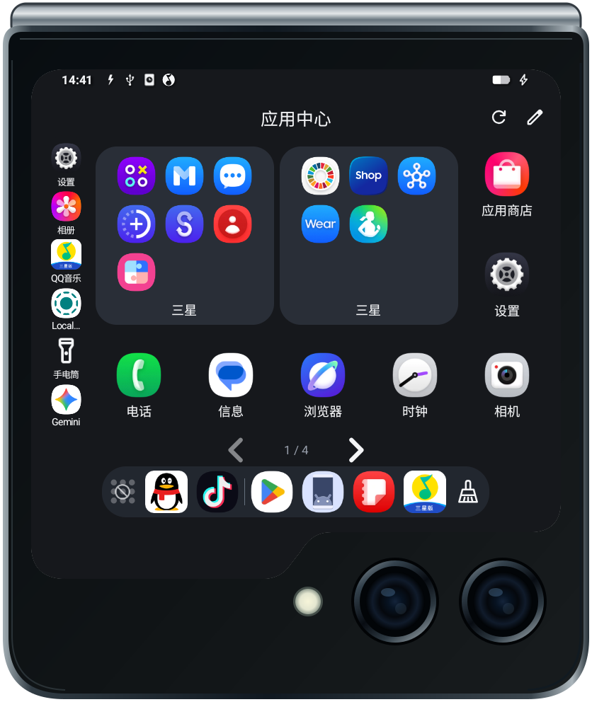
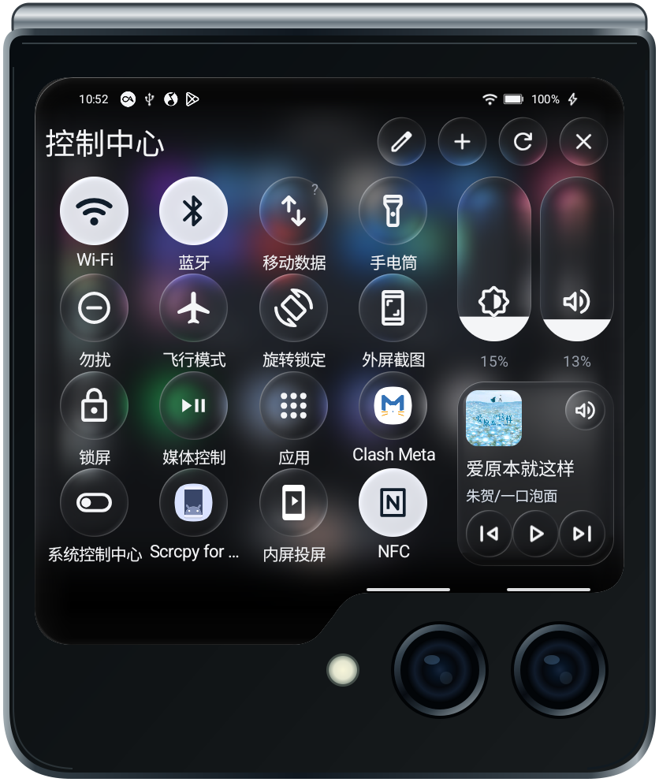
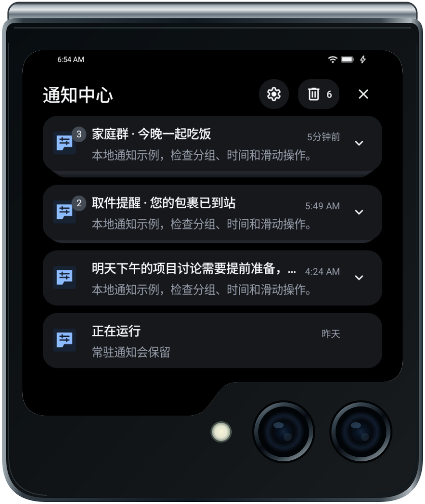
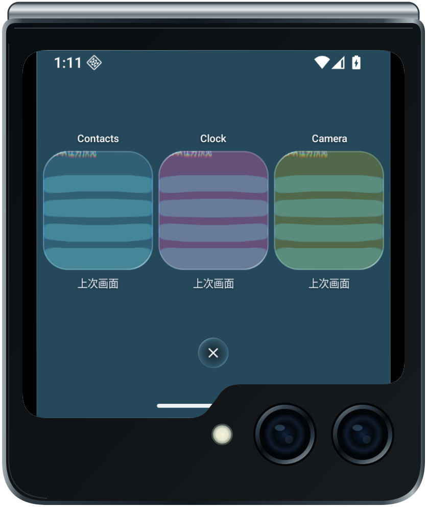

# Flip外屏助手

## 功能体验

[在线互动教程](https://xiaomaoju.github.io/zflip5screenhelper/flipcover-tutorial.html) · [原型页面](https://xiaomaoju.github.io/zflip5screenhelper/)

互动原型使用示例数据展示主要功能，可自动演示或手动体验，不连接手机。软件的外屏窗口、系统操作和第三方小组件兼容性需以三星物理真机表现为准。

## 软件介绍

Flip外屏助手是为三星 Galaxy Z Flip5 打造的外屏增强工具。项目起源于内屏损坏后的使用需求，希望只靠外屏，也能更方便地打开应用、切换任务、查看通知和控制常用功能，减少对展开手机的依赖。

软件无需 Root，部分系统操作需要 Shizuku 授权；通知、小组件和悬浮界面需要用户授予对应权限。主要面向 Galaxy Z Flip5 的 Android 16 / One UI 8.5 环境，实际兼容性取决于手机固件和系统权限。

## 界面展示

以下为已有版本的带框效果图，包含真机截图和模拟器示例，当前界面可能略有变化。

| 应用启动器 · 原生卡片 | 控制中心 |
| --- | --- |
|  |  |

| 通知中心 | 外屏多任务 |
| --- | --- |
|  |  |

## 主要功能

### 快捷栏与手势入口

自定义外屏快捷按钮、顺序、位置和显示方式，快速打开常用功能。通过两条横向白条分别进入通知中心和控制中心，可按屏幕方向调整入口位置，支持滑动展开、收起和长按切换快捷栏显隐。

### 控制中心

集中操作亮度、音量、媒体播放及常用系统开关，支持 NFC、移动热点和外接设备管理。快捷项可在面板内添加、移除、拖动排序和撤销，支持3、4、5列布局。部分系统操作依赖 Shizuku，Android 快捷设置磁贴执行属于实验功能。

### 应用桌面、文件夹与 Dock

在外屏浏览分页应用桌面，通过名称、别名或拼音搜索应用。支持手动排序、拖动整理、文件夹、布局锁定和应用显示偏好。

侧栏常用应用与 Dock 固定应用可分别配置。Dock 提供固定应用、最近应用、任务清理和应用中心入口，方便在外屏启动应用与切换任务。

### 外屏多任务

以任务卡片浏览所选外屏的最近任务，支持横向滑动、点击恢复、上滑关闭、下滑锁定或解锁，以及清理未锁定任务。任务预览使用系统快照；移除任务不保证结束应用的所有服务进程，任务锁也不等同于系统常驻。

### 通知与媒体

查看已授权的活动通知、打开或清除通知，并在应用桌面显示通知角标。媒体卡片提供播放控制和详情进度。通知角标反映符合条件的活动通知，不等同于系统未读数。

### 三星原生卡片

- **应用启动器卡片**：在三星外屏卡片中浏览应用、打开文件夹、使用侧栏和 Dock，与浮窗启动器共享布局和偏好。
- **小组件组合卡片**：提供6个独立入口，在每张卡片的4×4网格内组合已授权的 Android 桌面小组件，调整位置和尺寸。

### 鼠标、触控板与键盘

支持为鼠标和触控板配置指针操作或方向导航；实体键盘可用方向键选择、确认键操作和取消键返回。导航覆盖助手自有界面及满足条件的助手原生卡片，复杂布局编辑保留触摸操作。

### 外观、设置与备份

提供 One UI 风格设置、玻璃材质与过渡动效，可调整助手状态栏、快捷栏和布局偏好，按应用隐藏助手绘制的状态栏或收起快捷按钮。支持从本工具启动应用时应用方向规则、配置导入导出及布局备份。

### 手动在线更新

在设置中手动检查新版、下载并校验安装包，再由 Android 系统确认安装。联网仅用于用户发起的更新检查和下载，不上传通知、配置或设备信息，不增加分析追踪，不自动授权或绕过锁屏。
