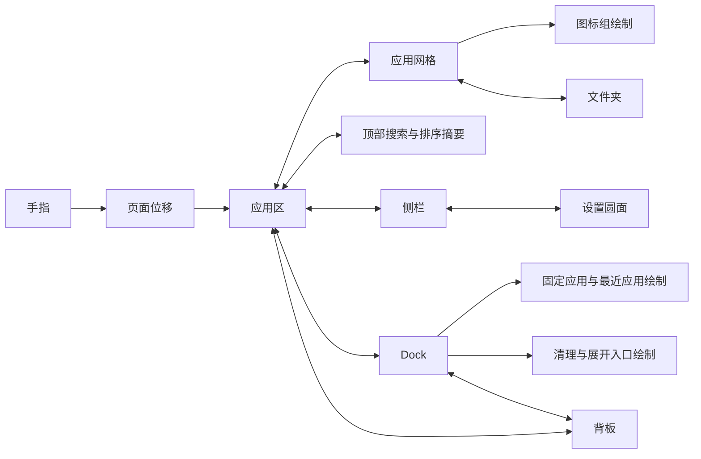

# 启动器与 Dock 的关联弹性设计

设计体验入口：`dist/launcher-force-jelly.html`。可直接用普通浏览器打开，唯一外框引用 `dist/device-frames/zflip5-cover-overlay.svg`，不依赖网络、外部字体或 Codex。图标、目录与清理结果均为示例；原型拖拽只回原位，不提交布局。Android 浮窗启动器现已通过 `LauncherForce` 接入区域弹性，具体实现和验证边界见下文。

## 受力关系

固定使用8个受力点：背板、应用容器、应用网格、顶部搜索／排序／摘要组、侧栏、设置圆面、Dock、文件夹。它们共用8条连接。每个节点有位置、速度、质量、静止锚点与阻尼；页面位移承接手指，局部形变承接页面加减速。图标不再拥有独立弹簧，也不连接邻居；继承所属区域的共享绘制变量，用简单位移和拉伸缩放产生整体果冻感。

相对质量：设置0.8、文件夹1.2、顶栏1.4、应用网格1.5、侧栏2、应用容器2.8、Dock3.2、背板5。默认“柔软果冻”，通过较低阻尼和有限缩放实现，不能为柔软感增加图标弹簧。每帧两次数值子步，固定16次节点积分和16次连接计算，图标数量不增加物理解算量。停帧期间不计算；等待设置分裂时只保留一个定时器。原型仅背板保留共享背景模糊，内部表面用透明填充、描边和缩放，不重复叠加各自的背景模糊。

整张卡片滑出时，背板和正文继承同一个卡片位移。Android 手动收起保留既有两段流程：应用区先向固定 Dock 收起，再从实际位置将剩余卡片滑出；每段背板与对应正文同步，局部果冻反馈只参与绘制。

## 交互

| 触发 | 受力与视觉 | 结束条件 |
| --- | --- | --- |
| 开启弹出 | `InterfaceCard` 从实际入口所在边进入；页面减速冲量传入图标和 Dock，沿运动轴拖长，落稳时轻微压扁 | 一次明显回弹后衰减；不等动画结束才允许新触摸 |
| 左右分页 | 页面跟手，网格整体略滞后，所有图标共享沿速度轴的拉伸；Dock 和背板有轻微关联位移 | 既有分页判定与合法页吸附不变，280ms 轻微过冲插值传入同一受力图；再次触摸接续当前页位移 |
| 首尾越界 | 保留既有网格边界阻力，实际位移驱动共享受力，节点限幅 | 松手回合法边界，不增加外侧列或逐图标弹簧 |
| 按压 | 保留按钮按压反馈，所属区域获得短冲量；背板复用纹理产生浅反作用 | 衰减回原形；不能延迟应用启动请求 |
| 长按拖起 | 保留原拖影与落点流程，图标共享网格拉伸 | 落位/取消接回现有拖拽流程；动画不能改变合法落点、合并1秒阈值或提前保存 |
| 文件夹打开 | 文件夹和成员使用一个共享受力点，打开时获得冲量 | 名称与成员标签保持比例，不改变2×2逻辑占位及成员排序 |
| 侧栏滚动 | 滚动内容沿竖向有少量速度滞后；边缘渐隐、胶囊裁切维持现有责任 | 列表边界才可产生橡皮筋拉伸；不抢系统横滑 |
| 设置圆面分裂 | 图标起初位于侧栏底部；固定延时后圆面和图标一起下移，拉细液颈并分离，保留原最终位置 | `ENTRY_ESTIMATE_MS=900`、`SPLIT_WAIT_MS=100`、`SPLIT_DURATION_MS=659`；从开启算起1000ms后开始分裂，不监听入场完成 |
| Dock 展开/收起 | 同一 Dock 始终保留；展开将力传入应用区，收起由 Dock 接住应用区冲量 | 沿用应用区先退、Dock 后退的两段交接；背板与正文同步 |
| 清理按钮 | 沿用按钮按压并向 Dock 区传力；任务更新仍由既有系统结果路径处理 | 请求等待不单独驱动动画，不增加推测成功的退场 |
| 应用启动 | 立即发起既有启动/恢复请求，图标压缩回弹提供反馈 | 仅系统接受启动或确认恢复后关闭界面；失败保留界面和提示 |

侧栏内容先滚动，边界才向共享模型施加非线性弹性距离，松手弹回；侧栏手势不触发分页或整张收起。关闭、Dock切换、尺寸变化及页面隐藏会取消旧分裂定时器。重新开启仅安排一次固定等待，不监听入场完成；既有原生液态材质、拖拽保存和系统请求路径继续负责各自行为。

## 幅度与手感

以真实 dp 和现有静止格位为基准；以下为初始调校值，需外屏真机确认。

| 表面 | 位移建议 | 拉伸与旋转建议 |
| --- | --- | --- |
| 应用图标 | 通常2–5dp，边界至多8dp | 通常3%–6%，上限8%；倾斜不超过2° |
| 文件夹 | 通常2–4dp | 正方形静止轮廓保持；瞬态形变不超过4% |
| 应用区/侧栏 | 通常1–3dp | 表面不超过2%；文字只平移、不拉伸 |
| Dock | 通常1–3dp，极限5dp | 整体玻璃平移；内部图标共享拉伸，无独立节点 |
| 背板/纹理 | 通常0.5–1dp | 仅偏移既有纹理采样原点，反作用小于内容位移 |

原生节点位移按1.5–8dp限幅，侧栏边界上限8dp，图标拉伸上限6.5%，反轴收缩为拉伸量的65%；两个速度轴通过连续应变相减，避免主轴切换时形状突变，不增加旋转或动态阻尼状态。默认柔软果冻，平衡与紧致只保留作原型比较，不增加应用偏好设置。入场含图标余振整体按900ms估计，再等待100ms分裂，避免复杂的动画完成协调。系统关闭动画时停止受力计算，设置直接显示已分离状态。

## 边界稳定与本次布局

横向手势传入累计位移，`AppWorkspaceView` 在边界阻力和页重定位前计算实际位移差，只有新位移才注入冲量；重复相同 MOVE 不再持续推动弹簧。按住侧栏达到平衡时保留所有关联节点的位置，不能把无直接目标、仍受邻接牵引的节点归零。只有全部目标释放且稳定后才统一归零。这两条路径与速度主轴离散切换是已用回归检查覆盖的抖动来源；不能据此宣称所有真机掉帧都已消失。

内部表面与外层背板留8dp空隙，由 `AppLauncherStyle.SURFACE_INSET` 管理；浮窗及原生分区布局共用几何。文件夹浮窗成员面板最大168dp，3列成员紧凑排布；编辑移到右侧末端，移除关闭×。管理选项使用34dp行高，最大208dp宽；点击同卡片宿主内的任意外部空白关闭。点击层覆盖宿主，正文及弹簧过冲仍受原安全范围约束。文件夹打开捕获原文件夹入口，复用控制中心的 `DetailSheetMotion`，不另建物理模型。

文件夹、网格和区域的 Canvas 位移及拉伸加入 `GlassSurface` 的材质坐标，沿翻页与拖动更新复用纹理，显式使文件夹表面绘制缓存失效；弹窗样式先完成，再安装玻璃，避免覆盖已绑定表面。此处更新的是表面相对既有背景纹理的取样，不新增外部背景截屏或后台轮询。

Dock 开启先显示三块独立玻璃：只包住应用的紧凑胶囊，以及完整九宫格和清理圆面。应用核心固定在最终锚点，内部不绘制两端预留空位。`AppDockView` 以既有900ms入场估算加300ms等待安排一次吸合，再用一个560ms时钟同时扩宽胶囊、将两端图标向中间非线性平移；图标全程不缩放、不淡出，大小及padding沿用最终规格。`LauncherMotionLayout` 只投影轮廓和端部位移，不移动应用核心或重新测量。独立圆面直径22–28dp、间距至多4dp，由 `AppLauncherStyle` 管理，并按现有可用余量计算一次，避免挤出宿主。三个轮廓及两处细颈由同一组共享张力绘制，不叠加独立玻璃；结束收敛为单胶囊，材质不切换。无最近任务只融合左端；无应用核心则直接显示现有完整入口。工具可立即点击，提前点击完成装饰后执行原动作。等待期间无吸合帧，隐藏、多指、取消、尺寸变化及卸载取消等待和时钟。原生RemoteViews仍保留共享最终几何，不接入自定义吸合。

## Android 落地责任

- `LauncherForce` 提供纯数值模型，仅保留8个区域节点及8条连接，不创建逐图标节点，不扩充任务页专用六节点模型。
- `AppHubView` 负责会话与唯一受力帧回调；`LauncherMotionLayout` 提供区域 Canvas 平移。`AppWorkspaceView` 将共享网格形变应用到现有至多三页绘制，`AppDockView` 用一个整体受力点绘制固定、最近和工具区。图标无需独立帧回调、物理状态或常驻合成层。搜索、排序和两条摘要文字由同一个 HEADER 容器承接。
- `AppLauncherStyle` 继续独占静止尺寸与几何；动效不更改测量、字号、内边距、命中范围、格位或目录顺序。原型画布仅用于手感演示，Android 必须使用现有真实显示密度与安全边界。
- `RuntimeVisuals` 或专属绘制适配在原按钮命中区域内变换图标；标签只平移，不能通过整体 View 缩放扭曲文字或移动命中区域。当前分页位移是既有语义运动，局部果冻位移必须作为额外绘制量处理。
- `LiquidTensionSurface` / `LiquidTensionRenderer` 继续负责玻璃轮廓，`LauncherSidebarView` 负责一个1000ms定时器、659ms分裂动画和内容裁切；数值受力只提供形变输入，不维护第二套材质动画。侧栏通过 `dispatchTouchEvent` 观察完整手势，避免按钮消费 DOWN 后丢失边界输入；`PanelSurface` 保护该滚动区。STACK玻璃容器在硬件显示列表中会跳过 `draw()`，所以侧栏平移放在必经的 `dispatchDraw()`，同时包住共享玻璃与正文。无背景的顶部组、文件夹预览和成员容器显式启用绘制，确保其 Canvas 变换执行。检查不能只验证弹簧数值：`LauncherForceChecks` 对比硬件截图中的侧栏图标像素，旧实现受力约6.34dp而像素移动0。
- `PanelGlassSession` 复用本卡片纹理；不新增截屏、取样、窗口或位图缓存。
- 帧内复用8节点数值数组和绘制对象；浏览器通过共享CSS变量传递图标拉伸，原生通过共享Canvas变换绘制，避免为每个图标建立物理状态。只绘制可见区域，禁止给所有图标常驻`will-change`层；静止和仅等待系统请求或分裂延时时停帧。实际GPU合成成本仍须真机测量。
- 多指由公共容器在子控件拆分前取消；真实尺寸变化、卸载、息屏和目标外屏变化取消旧手势、长按、帧回调与拖影，释放会话。禁止在动画中重测页面或重建窗口。
- Samsung `LauncherWidgetViews` 使用 RemoteViews，保留共享数据、静止几何、图标及颜色，不能承诺自定义二维弹簧、内层横滑、液态分裂或实时材质。原生宿主的左右滑动仍归三星管理。

## 验收边界

原型须在普通浏览器离线直接打开；确认5×3分页、长按与横滑互斥、边界回弹、关闭与重开连续、Dock 切换、取消、多指、减弱动效及静止停帧。唯一标准机身贴图在 UI 最上层叠加一次。

Android 检查 `LauncherForceChecks`、`InterfaceCardChecks`、`HubMotionChecks`、`MotionContinuityChecks`、`AppWorkspaceChecks`、`AppFolderChecks`、`AppDockChecks` 和 `LauncherWidgetChecks` 的对应场景；`LauncherForceTest` 覆盖连续反向、不同帧率、快速冲量限幅、按住边界停帧与释放回零。结果见 `dist/VALIDATION-0.17.3-launcher-force.md`。物理三星外屏触摸延迟、GPU合成耗时、实际安全边界与宿主兼容性仍须真机验收，模拟器结果不能替代。

本次侧栏实际绘制与 Dock 双端空间／横向入场的增量验证见 `dist/VALIDATION-0.17.3-launcher-edge-slots.md`，前次结果保持历史记录。

Dock 独立圆面吸合验证见 `dist/VALIDATION-0.17.3-dock-liquid-fusion.md`；先前向外弹出的实现保留于历史报告。
