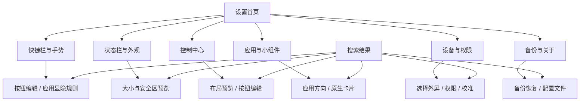

# 设置 UI/UX 整体重构方案

日期：2026-09-28。此文保留阶段 A 的设计依据与迁移方案，设计基线为 0.10.0 / versionCode 26；用户确认后已实施为 0.12.0 / versionCode 28。当前交付和实际验收见第 9 节。第 8 张参考已替换为“主屏幕”。

## 设计入口

- [可复用 Skill](../.agents/skills/oneui-settings-design/SKILL.md)：以后在本项目对话中进行设置设计、原型、实现或评审时使用。
- [UI/UX 设计规则](../.agents/skills/oneui-settings-design/references/design-rules.md)：视觉变量、配置展示、提交、返回、窗口适配和验收。
- [九张参考图分析与官方依据](../.agents/skills/oneui-settings-design/references/reference-analysis.md)：本地原图、各图含义、官方链接以及项目自定规则的区别。
- [双 Skill 协作规则](../.agents/skills/oneui-settings-design/references/android-skill-integration.md)：已安装的 `mobile-android-design` 提供 Android 适配、状态、组件语义和无障碍基础；项目 Skill 负责 One UI 风格及外屏业务，保留 Java Views 栈。

这轮先完成上述文档和复用入口。后续按本方案推进可交互原型和 Android 实现；文档交付不表示设置页面已经改版。

## 1. 要解决的问题

阶段 A 对 0.10.0 源码检查发现以下结构性问题，尚未将它们全部当作真机复现结论：

| 现状证据 | 用户影响 | 重构决定 |
|---|---|---|
| `MainActivity.home()` 一页列出 18 个入口；摘要多为功能说明 | 需要读较多文字才能找到任务，不易判断当前值 | 六个任务分类，保留设置搜索；类别摘要与设置当前值区别显示 |
| `Ui.settingRow()` 名称 14sp、摘要 11sp；`Ui.add()` 通用下间距 4dp | 信息密集，解释和操作视觉层次偏弱 | 设置组件独立采用 16/17sp 名称、14sp 值与说明、明确分组间距 |
| `toggleSetting()` 每次新建一个独立组，`editor()` 混合成排按钮、说明和操作 | 同一任务散成多个块，浏览和编辑混在一起 | 同组列表；预览编辑器；增删排序独立页 |
| `begin()` 标题返回总调用 `home()`；`appOrientation()` 额外补“返回应用列表” | 标题返回与用户实际来源不一致 | 保存导航来源；标题返回、系统返回和搜索返回一致 |
| `changePanelOption()` 调用 `editor()` 重建，后者恢复部分 scrollY | 更新可能打断焦点、编辑上下文；滚动恢复覆盖不完整 | 稳定页面树，按键/条目身份更新；路由单独存状态 |
| `showRoute()` 未列入 `display`；`library()` 依赖 `editing` 状态 | 需要在实施时专项核对旋转/进程恢复与深链参数 | 以完整路由对象表达页、来源和编辑目标，覆盖恢复检查 |
| `Ui` 同时被设置、面板、媒体、应用中心使用 | 全局“换皮”会扩大影响范围 | 设置专用主题与行组件，不直接全局修改共享视觉常量 |
| `NativeWidgetActivity` 自建标题、说明、列表和按钮 | 设置主流程之外仍有第二套配置体验 | 迁移应用自有管理/选择页面，保留三星与组件系统流程 |

现有代码已经有分组、搜索、部分预览、偏好校验和撤销，这些保留并统一。重构对象是设置的信息架构、组件和交互，不重写可靠的显示器、权限、任务与组件桥接逻辑。

## 2. 新设置首页与导航

紧凑标题“外屏助手”＋搜索入口；其下主开关与一条真实运行状态；然后显示六个分类。异常状态给一个就近解决入口，不能压满首页。

| 一级入口 | 包含的设置 | 首页摘要示例（须从真实值生成） |
|---|---|---|
| 快捷栏与手势 | 按钮与顺序、固定按钮、自动显隐、按应用规则、手势、导航避让、单手布局 | 每页 4 个 · 自动收起 |
| 状态栏与外观 | 常驻状态栏、尺寸、左右安全区、显示内容、常驻电量百分比、悬浮栏风格、共享背景模糊入口 | 70% · 透明描边 |
| 控制中心 | 预览、布局预设、列数/疏密/名称、工具区、按钮编辑、局部恢复与撤销 | 4 列 · 标准 |
| 应用与小组件 | 临时 Dock/应用中心说明、底部固定应用、侧栏常用项、应用方向、原生外屏小组件 | 固定应用 2/3 · 原生卡片 1 张 |
| 设备与权限 | 目标外屏、屏幕适配、权限中心、兼容性诊断 | 外屏已选择 · 通知未授权 |
| 备份与关于 | 布局备份/恢复/撤销、配置导入/导出、版本/日志/隐私/许可 | 已保存布局 · 0.10.0 |

示例不是默认事实。摘要不足以容纳时优先最相关的 1–2 个值；无数据用真实空状态。首页普通浏览不展示每一项底层参数。

搜索索引覆盖设置名称、常见同义词与路径，不仅过滤首页分类。结果显示“名称＋当前值＋所属路径”，直接定位对应设置；返回保留搜索词、结果位置和焦点。搜索“电量”应找到常驻电量百分比，并在详情说明控制中心始终显示百分比。

## 3. 现有入口迁移清单

源码符号与路由是 2026-09-28 的盘点，实施时重新确认。所有原功能有归宿，名称可改善，能力和配置语义不能悄悄改变。

| 当前入口/源码 | 新位置与呈现 | 必须保留 |
|---|---|---|
| `home()` / `main` | 首页主开关＋六分类＋搜索 | `enabled` 与服务运行状态分开 |
| `editor("dock")` | 快捷栏与手势 → 按钮与布局 | 每页 2–5、固定键、翻页按钮、添加、顺序、移除、阻尼 |
| `visibilitySettings()` / `visibility` | 快捷栏与手势 → 自动显示与收起；名单进入应用列表 | 前台应用自动收起、键盘收起、临时手动切换；不读取节点树 |
| `gestureSettings()` / `gestures` | 快捷栏与手势 → 手势与导航避让 | 导航避让、0–48dp 额外偏移、边缘拖动、震动、左右横条说明 |
| `handSettings()` / `hand` | 快捷栏与手势 → 单手布局 | 默认/左手/右手，固定键预览，不镜像缺口 |
| `statusSettings()` / `status` | 状态栏与外观 → 状态栏；预览与大小/留白成组 | 主开关、50%–150%、左右 0–48dp、预设、七类信息、常驻电量百分比 |
| `appearanceSettings()` / `appearance` | 状态栏与外观 → 悬浮栏风格；带示意的单选 | contrast/black/light/dark 四值；不能声称识别其他应用 SystemUI |
| `editor("panel")` 的外观链接与模糊 | 状态栏与外观 → 面板背景；控制中心保留相关链接 | 共享 `panel_blur`，设备不支持时如实回退；同一偏好仅一个编辑来源 |
| `editor("panel")` / `panel` | 控制中心 → 预览、布局、显示内容、按钮编辑、恢复 | 手动 3/4/5 列、密度、名称及字号、工具位置、亮度/音量/媒体/闲置收纳、原子校验与撤销 |
| `hubSettings()` / `hub` | 应用与小组件 → 应用 Dock 与中心 | 固定最多 3 个，侧栏独立，固定键设应用中心、清空固定应用的明确操作 |
| `editor("favorites")` / `favorites` | 应用与小组件 → 侧栏常用项 | 应用/工具混合添加、移除和排序，不与固定 Dock 应用合并 |
| `library()` / `library` / `hub_pin` / `apps` | 按使用场景进入按钮库、应用选择或应用启动页 | 内置、应用、系统磁贴来源；每区最多 30 个快捷项；磁贴“注册系统”独立操作及实验性质；编辑目标参数；启动与选择模式区别 |
| `orientationSettings()` / `orientations` | 应用与小组件 → 应用方向 | 搜索、应用名、当前策略、已保存但不可用应用规则 |
| `appOrientation()` / `app_orientation` | 应用方向 → 指定应用；图标/名称＋单选示意 | 沿用当前/跟随系统/四角度；仅显式启动应用时执行一次 |
| `NativeWidgetActivity.management()` | 应用与小组件 → 原生外屏卡片 | 添加步骤、已绑定列表、刷新、三星原生移除说明 |
| `NativeWidgetActivity.show()/choose()/configure()` | 原生卡片 → 当前组件/更换组件 | 最大 4×4、当前用户、已选择且亮起外屏、授权与配置、结果回传、取消保留旧组件 |
| `chooseDisplay()` / `display` | 设备与权限 → 目标外屏；状态单选 | 自动可靠识别、当前选择、主屏不可选、失联不回退主屏 |
| `calibrate()` / `calibrate` | 设备与权限 → 屏幕适配；四方向示意＋高级手动项 | 自动缺口、每方向角落、长度 25%–70%、厚度 5%–22%、暂停快捷栏 |
| `permissions()` / `permissions` | 设备与权限 → 权限；按必要/可选解释 | 无障碍、Shizuku、通知使用权、相机/手电筒、电话状态，全由用户授权 |
| `diagnostics()` / `diagnostics` | 设备与权限 → 问题诊断；摘要＋详情＋复制 | 只读兼容性、Shizuku 检测、原始结果可复制，不添加通知正文 |
| `layoutSettings()` / `layout_backup` | 备份与关于 → 布局备份与恢复 | 保存/替换、恢复、撤销、恢复默认、时间戳、保护字段 |
| `exportConfiguration()/importConfiguration()` | 备份与关于 → 配置文件 | 系统文件选择器、旧格式、原子校验、导入保护字段和现有合法范围 |
| `about()` / `about` | 备份与关于 → 关于 | 实际构建版本、更新日志、隐私、随包许可证、诊断入口 |
| 从 Dock/面板/应用中心进入的编辑入口 | 继续进入同一设置路由，记录来源 | 深链参数、返回来源；不产生另一套相同配置页 |

`ControlDetails` / `DetailSheet` 中实际属于即时控制的亮度、音量、网络、媒体弹层保持原业务；如其中有进入设置的入口，只更新指向和返回。`SystemOutputActivity` 的系统输出选择流程不作为自绘设置重写。

## 4. 关键页面具体设计

### 状态栏与大小

首组显示“常驻状态栏”总开关和适用条件。下一组预览时间/通知在左、网络/电池在右；大小行显示百分比，滑条在下。左右留白分成两个有单位的控制项，共享同一个预览。显示项目在一个列表组内，预设作为入口行，当前值为“极简/日常/全部/自定义”。常驻百分比开关下明确控制中心始终显示百分比。

常驻栏关闭时，共享预览与安全区仍可用于控制中心配置；不机械禁用全部后续项。实时订阅只在需要且可见时存在，离页释放。

### 控制中心

首个圆角组使用图 8 的“预览＋相邻配置”：首屏只放预览与最重要的列数/预设摘要；其余分成“排列与名称”“工具与媒体”“按钮”“恢复”四组。列数专用预览页可直接比较 3/4/5 列。旋转后保持手动列数。

密度、名称大小和工具位置默认是“名称＋当前值”行，点开单选；亮度、媒体音量、媒体卡和闲置收纳为开关。媒体音量说明“整个手机”；工具区实际回退到底部时在预览旁说明，不能偷偷改变所选列数。按钮列表浏览时不常驻三枚小操作图标，进入编辑后才提供增删排序。

保留局部恢复与撤销。背景模糊是与应用中心共享的外观项，通过相关入口访问同一设置，不能复制成两个状态源。

### 快捷栏与手势

快捷栏预览在前，“每页按钮 / 4 个”“固定按钮 / 应用中心”“起步阻尼 / 标准”放同组；“按钮顺序”进入编辑页。用图示说明左右横条向内拖动，图下放一条行为说明，再列开关。单手布局只变安全区域内的控件顺序。

自动显隐的两个全局偏好在前；“指定应用只显示横条 / N 个”进入应用列表，每行一个开关。图 2 作为布局参考，不复制“外屏应用实验室”的功能含义。

### 应用与小组件

底部固定应用显示最多三个图标和“2/3”，编辑时说明剩余名额；与侧栏常用项分开。应用方向按图 7 展示图标、应用名和蓝色当前策略，进入单个应用才展示角度示意。原生卡片页采用介绍＋列表：未添加、已绑定、尺寸不合、待授权、已取消、失败分别处理。

应用方向的角度选项沿用即时保存规则：点选后更新本地示意并留在该应用页，下一次从本工具启动时才执行方向。未选择就返回不写入；已选后返回不撤销，不设置看似能回滚的“取消”按钮。带“完成/取消”的草稿模式仅用于明确设计为批量提交的编辑流程。

组件自己的配置和系统授权不换皮；取消更换回到原组件，离开流程清理待完成实例但保留现有绑定。卡片移除仍通过三星原生入口，不新增不可兑现的应用内“直接移除卡片”按钮。

### 设备、权限与恢复

目标外屏行显示可靠名称与状态，详细 ID/尺寸放二级信息。主屏行如需解释可只读显示，不进入可选项。缺口校准用本项目几何示意和单位明确的参数，未知缺口明确标为估计。

权限页使用状态行与系统入口；不把“已开启”本地开关当授权成功。备份页将本机布局快照与可导出的配置文件分开；恢复/覆盖前显示范围，已存在的撤销继续可达，保护目标显示器、权限和系统显示设置。

## 5. 实现结构建议

以下是拟新增职责，不是要求建立通用 UI 框架。先在 Java Views 栈中完成一条流程，再按复用需要拆分；本次设计不要求引入 Compose、Material 全家桶或三星私有 SDK。

| 拟定职责 | 边界 |
|---|---|
| `SettingsTheme` | 设置页语义色、文字、圆角和间距；不能替换共享 `Ui` 的运行时常量 |
| `SettingsComponents` | 组容器、导航行、开关行、值行、解释、预览块、状态显示；不自行调用 Shizuku 或执行系统动作 |
| `SettingsNavigator` | 路由栈、来源、参数、搜索/滚动/焦点、恢复；不持有过期 Activity/显示器对象 |
| 设置页面构建器 | 先按六类拆分 `MainActivity` 的视图拼装；维持生命周期与取消边界 |
| 设置索引 | 共用页面/设置标识、标题、搜索词与路径；当前值通过 `Prefs` 或当前能力读取 |
| 长列表与异步状态 | 参考 `mobile-android-design` 的稳定条目标识、按需渲染与加载/成功/失败模型；同时区分未授权、空结果和目标失联 |
| 原有 `Prefs` 与业务所有者 | 继续负责偏好、校验和能力；先复用方法，再对必要写入做小范围封装，禁止双存储 |

`MainActivity` 保留宿主与系统返回/结果生命周期；`NativeWidgetActivity` 可复用设置壳与行组件，但不能合并其授权结果流程。`DetailSheet` 保持自有二级弹窗测量和动画所有权。预览尽量复用原渲染规则；不为预览创建可执行真实动作的伪服务。

单项变更更新原行；依赖可见性按设置标识增加/隐藏局部项。过滤和列表异步加载复用缓存，回调检查页面存活与请求身份。字号/旋转导致必须重排时恢复路由和滚动锚点，不把旧像素 scrollY 当唯一恢复机制。

不改变合法范围与默认值：状态栏默认大小以 `Prefs.statusScale()` 为准（当前 70%）；安全区当前左右各 16dp；控制列数默认 4；固定应用上限 3；快捷项每区最多 30 个；应用方向规则最多 200 项。历史配置版本保持可读；UI 独有路由和草稿不进入布局导出；原生组件绑定仍不进入配置文件。

## 6. 实施顺序与验收门槛

| 阶段 | 交付 | 完成条件 |
|---|---|---|
| A 规则与盘点 | 项目 Skill、九图分析、设计规则、全入口迁移表 | 第 8 图正确；引用可达；规则不冲突；明确现状/拟定/验证边界 |
| B 可交互设计 | `dist/settings-oneui-prototype.html` | 首页、状态栏预览、单选、应用列表、排序、权限/失败均可演示；普通浏览器可本地打开；示例状态标注 |
| C 设置骨架与示范流程 | 设置主题、组件、导航；首页 → 状态栏 → 预览/选择 → 返回 | 在窄外屏与大字下通过；返回/搜索/取消/保存语义成立；运行时 UI 未被全局改色 |
| D 全量页面迁移 | 按迁移表完成其余页面、原生组件自有入口与深链 | 旧配置与各功能可达；不遗失编辑目标或系统结果；所有设置使用同一规则 |
| E 回归与交付 | 验证构建、说明、最终效果图和验收记录 | README 构建与相关本地检查通过；按下表标明真机边界 |

原型没有设备 API，不用“授权成功”动画假装系统可用。HTML 必须在普通浏览器打开并验证已有交互；最终效果图遵守 `dist/device-frames/README.md`，唯一外框在最上层、方向同步、不镜像。

阶段 B/C 先验证组件与一条完整链路，随后继续全量迁移。阶段 A 先交付设计；后续 B–E 的完成情况以第 9 节及验证记录为准。

## 7. 必须覆盖的回归与验收任务

- 按 `README.md` 执行 `:app:assembleDebug :app:testDebugUnitTest :app:lintDebug`，产物在 `Cache/build-output.nosync/app/`。
- 保持/适配已有 `PanelSettingsChecks`、`StatusSafeAreaChecks`、`ReadabilityChecks`、`NativeWidgetChecks` 与通用 `UiSmokeInstrumentation` 中受影响的用户行为；测试标识改变须更新映射，不按旧视图数量机械断言新布局。
- 新的行为检查重点是：搜索直达再返回、来源栈恢复、旋转重建、单选取消、滑条触摸取消与 TalkBack 调整、排序完成/放弃、授权回读、失败保留上下文。只为实际风险补检查，不给纯颜色变化堆测试。
- 本地 UI 尺寸覆盖 720×748 的 340/440dpi，交换宽高；字体 100%/130%/200%；四方向与缺口；最后一行可达；主屏无静默回退。
- 核验导入损坏配置零写入、恢复保护字段、3/4/5 列不随旋转改变、50%–150% 状态栏范围、固定应用和侧栏互不覆盖、组件绑定不导出。
- 物理 Flip5 单独验收真实安全区、触感、输入法、三星系统页路由、Shizuku 断连恢复、原生卡片收录与授权取消、锁屏及息屏。模拟器不能将这些项判为通过。

## 8. 阶段 A 历史交付状态

本轮仅增加设计文档、项目 Skill、原样参考图与发现入口，并安装通用 `mobile-android-design`；未改变 Android 源码、版本号、运行时外观或用户配置。

2026-09-28 本地检查：两套 Skill 的结构校验通过；42 个本地文档链接有效；九张原样图片各不重复，第 8 张与用户替换图字节一致；新文档无电脑私有绝对路径。建议文字色与所列背景的对比度计算最低 4.99:1，浅灰主开关底使用专门的激活轨道色。颜色计算不是实际 UI 渲染验收。

按 README 执行基线构建、单元测试和 Lint，`BUILD SUCCESSFUL`（51 项任务中 50 项命中已有结果）；现有单元测试报告 41 项、0 失败，Lint 0 错误、45 项已有警告。日志保存在一次性本地检查目录 `Cache/tests/oneui-settings-design/build.log`。本轮未实施新 UI，也未执行其浏览器原型、模拟器交互或物理 Flip5 验收。

以后在本项目任务中可说：“使用项目里的 `oneui-settings-design`，评审或迭代设置页面”或指定某个设置页面。若其他项目需要复用，复制整个 Skill 文件夹并提供目标项目约束，重新盘点业务映射，不将 Flip5 专属规则直接当作其他项目事实。

## 9. 已实施交付：0.12.0

阶段 B–D 已完成；阶段 E 的构建、本地检查、Android 模拟器和普通浏览器验证见 [0.12.0 验证记录](../dist/VALIDATION-0.12.0-settings.md)，物理 Flip5 验收仍单独待执行。

| 实现 | 对应责任 |
|---|---|
| `SettingsUi` | 设置专属色彩、字号、分组、值行、开关、48dp 触摸目标和事务滑条 |
| `SettingsNavigator` | 最多 24 层来源栈；搜索、焦点、ListView 状态、排序条目锚点和重建恢复 |
| `SettingsApplications` | 可滚动搜索头、虚拟化应用列表、目录与图标缓存订阅、缺失应用已保存规则 |
| `SettingsIllustration` | 本地绘制方向、外观和手势示意；不使用三星插画或其他应用截图 |
| `MainActivity` | 六类首页、搜索直达、全部旧设置路由、预览/单选/草稿排序、导入确认与失效请求控制 |
| `NativeWidgetActivity` | 应用自有管理/选择页样式、返回、取消说明与滚动恢复；原绑定和系统授权流程保留 |
| `DetailSheet.settingsStyle()` | 设置弹层单独启用样式；运行中面板的默认样式保留 |

实际采用 Java Views，不引入 Compose。与并行完成的应用桌面共存，配置版本 11、布局版本 8；设置 UI 本身没有增加新的偏好模式或系统能力。原型是 [独立 HTML 文件](../dist/settings-oneui-prototype.html)，示例交互不调用设备 API。最终效果图从真实模拟器截图按唯一设备贴图合成，标注为模拟器结果。
